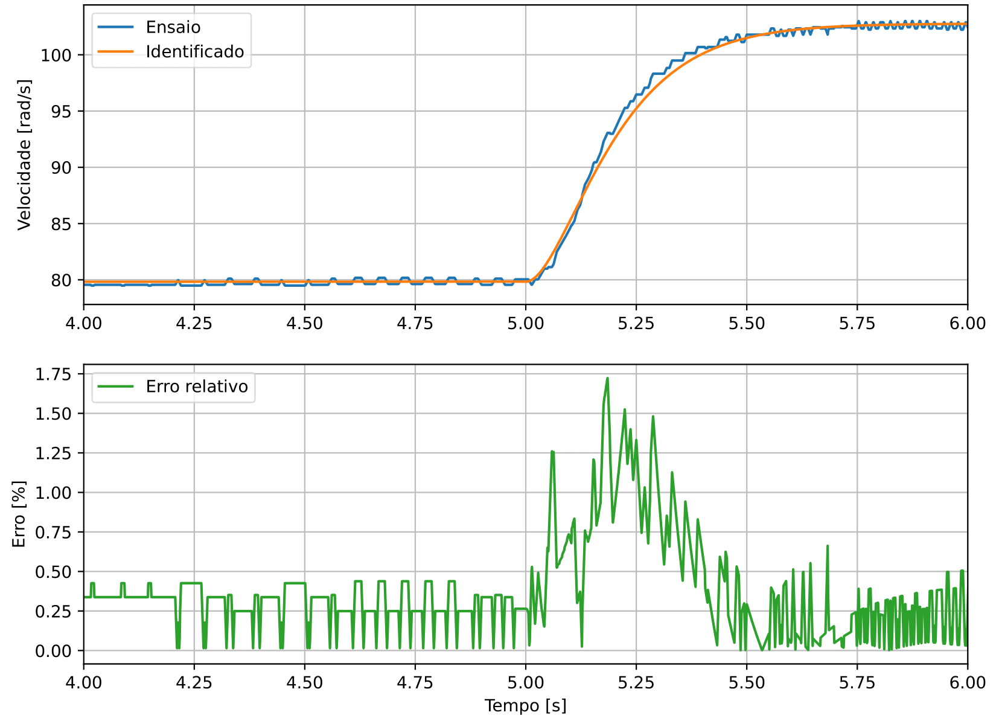

# O Software
 Ferramenta computacional para auxiliar na identificação do modelo dinâmico de um motor de corrente continua a partir da análise da curva de resposta transitória a uma entrada do tipo degrau.Desenvolvido em Python, é capaz de monitorar medidas em tempo real do motor e realizar as seguintes tarefas:
 
 1. Aquisição de dados do motor em tempo real:
     * Velocidade
     * Corrente.
 3. Análise detalhada da resposta transitória ao degrau;
 4. Geração de arquivo de dados;
 5. Identificação dos parametros do motor
 6. Determinação da função de transferencia de velocidade do motor em primeira e segunda ordem;
 7. Análise do erro entre as curvas de ensaio e identificada.

## Aquisição de Dados
No software são demonstradas as curvas de aquisição de dados, em tempo real. Os gráficos de corrente e velocidade de rotação do motor em regime permanente são mostrados abaixo.

## Análise de Dados

É oferecido ao usuário um gráfico detalhado, podendo ser analisado ponto a ponto paramelhor compreensão do ensaio realizado. Esse gráfico é feito utilizando a biblioteca plotly, e fornece uma ferramenta interessante para a análise do transitório.

## Arquivo de Dados

Nessa etapa ocorre a gravação dos dados obtidos durante o ensaio. Utilizando a biblioteca pandas, é feito o armazenamento de dados em um arquivo .csv  com data e horário do teste realizado. 

## Identificação dos parâmetros
A identificação dos parametros do motor é feita a partir da  análise do regime transitorio a uma entrada ao degrau. Através do tempo de acomodação, tempo de subida e maximo sobressinal são obtidos os parametros de ganho CC, constante de tempo, coeficiente de amortecimento e frequencia natural não amortecida.

## Determinação da função de transferência
Com a identificação dos parametros, é possivel montar a função de transferencia de primeira e segunda ordem utilizando a forma tipica.

## Análise do Erro

A análise de erro é feita a partir do erro relativo entre o ensaio e o gráfico com os parametros identificados. As figuras abaixo apresentam o erro para o modelo de primeira e segunda ordem.

Primeira Ordem           |  Segunda Ordem
:-------------------------:|:-------------------------:
  |  

# Circuito para Aquisição

Para realizar a aquisição de dados, é necessario a montagem de um circuito similar ao demonstrado na imagem.

 No microcontrolador é ajustada uma variação da razão cíclica. Neste, a razão cíclica permanece em 0,6 até que seja acionado o push-button, em que a razão cíclica é aumentada para 0,7. Essa razão cíclica (sinal PWM) é aplicada no conversor CC-CC (LM298M), que aciona o motor CC. Um conversor A/D do ESP32 discretiza a medida efetuada pelo transdutor de corrente enquanto que a velocidade é obtida diretamente a partir de interrupções causadas pela variação do sinal digital proveniente do encoder. 

# Instalação
Ao realizar o download do projeto, é necessário instalar o ambiente virtual e todos os pacotes utilizados no projeto. Para isso, basta executar no terminal os seguintes comandos:

1. pip install virtualenv
2. python -m virtualenv .env
3. .env\Scripts\Activate
4. pip install -r requirements.txt
